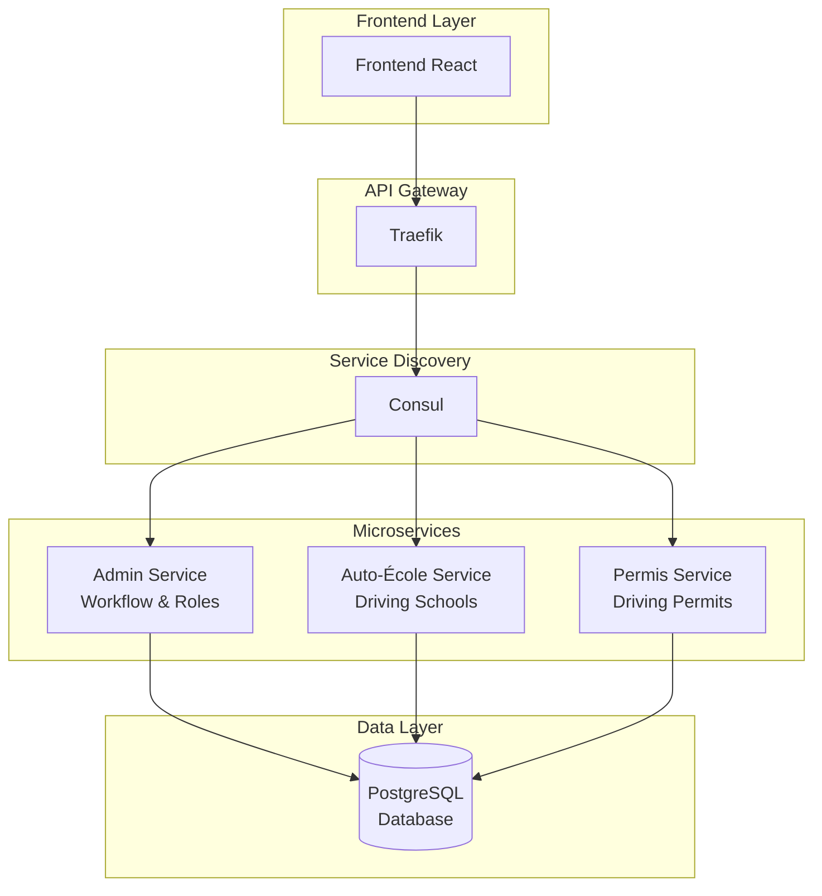
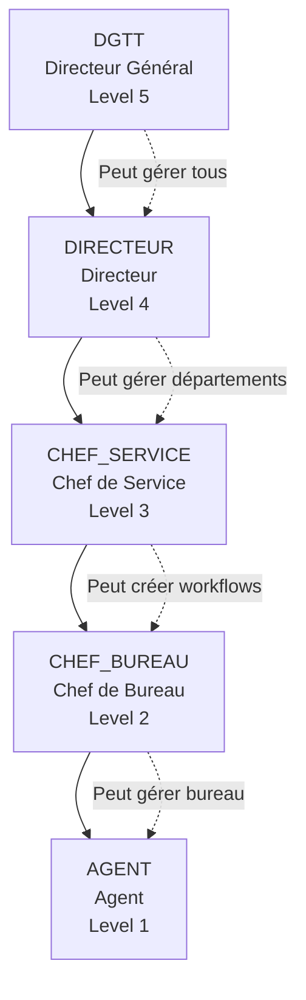
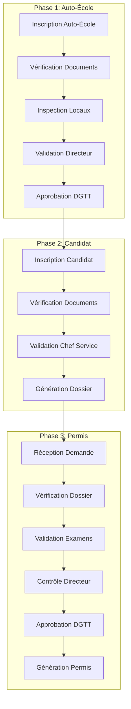
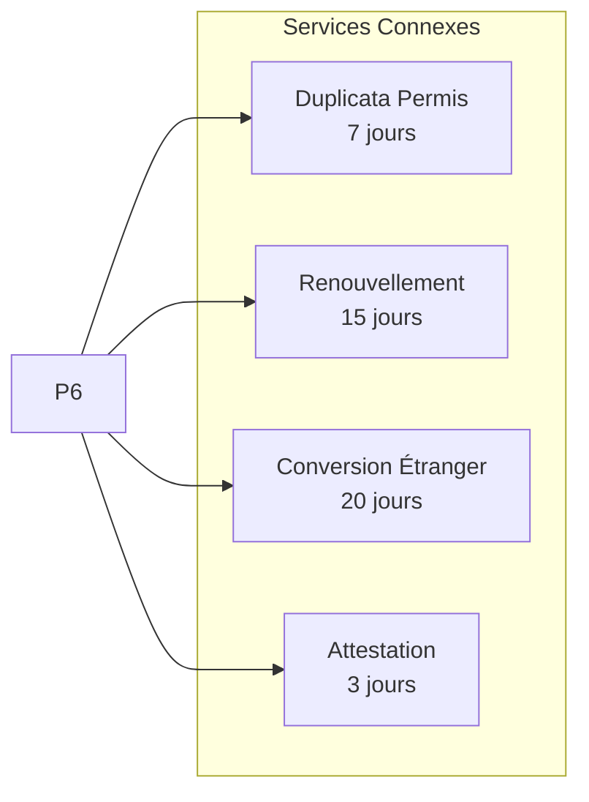

# 🚗 R-DGTT Portail - Système de Gestion des Transports

[](LICENSE)
[](https://openjdk.java.net/)
[](https://spring.io/projects/spring-boot)
[](https://reactjs.org/)
[](https://www.postgresql.org/)

## 📋 Table des Matières

- [Vue d'ensemble](#-vue-densemble)
- [Architecture](#-architecture)
- [Services](#-services)
- [Workflow Métier](#-workflow-métier)
- [Installation](#-installation)
- [Configuration](#-configuration)
- [Déploiement](#-déploiement)
- [API Documentation](#-api-documentation)
- [Contribution](#-contribution)

## 🎯 Vue d'ensemble

Le **R-DGTT Portail** est une plateforme numérique complète pour la gestion des services de transport au Gabon. Le système combine une interface d'administration interne avec un portail citoyen pour le suivi des demandes.

### ✨ Fonctionnalités Principales

- 🏢 **Administration Interne** - Gestion complète des départements, bureaux et processus
- 👥 **Portail Citoyen** - Suivi des demandes sans création de compte
- 🔄 **Workflow Configurable** - Processus métier flexibles et adaptables
- 🎭 **Gestion des Rôles** - Hiérarchie d'autorisation complète
- 📊 **Tableaux de Bord** - Suivi en temps réel des processus
- 🔐 **Sécurité** - Authentification et autorisation basées sur les rôles

## 🏗️ Architecture

### Architecture Microservices



### Hiérarchie des Rôles



## 🔧 Services

### 1. Admin Service (Port: 8081)
**Responsabilités:**
- Gestion des utilisateurs et rôles
- Configuration des workflows
- Gestion des départements et bureaux
- Moteur de workflow métier
- Portail citoyen (suivi des demandes)

**Endpoints principaux:**
- `/api/admin/*` - Gestion administrative
- `/api/workflow/*` - Gestion des workflows
- `/api/citizen/*` - Portail citoyen

### 2. Auto-École Service (Port: 8082)
**Responsabilités:**
- Gestion des auto-écoles
- Inscription des candidats
- Suivi de formation
- Gestion des examens

### 3. Permis Service (Port: 8083)
**Responsabilités:**
- Gestion des permis de conduire
- Traitement des demandes
- Génération des documents

### 4. Frontend (Port: 80)
**Responsabilités:**
- Interface d'administration
- Portail citoyen
- Tableaux de bord

## 🔄 Workflow Métier

### Processus Complet: Auto-École → Candidat → Permis



### Services Connexes



## 🚀 Installation

### Prérequis

- **Java 17+**
- **Maven 3.8+**
- **Node.js 18+**
- **PostgreSQL 13+**
- **Docker & Docker Compose**
- **Consul**
- **Traefik**

### 1. Cloner le Repository

```bash
git clone https://github.com/MoctarSidibe/rdgtt-portail.git
cd rdgtt-portail
```

### 2. Configuration de la Base de Données

```bash
# Se connecter en tant que superutilisateur postgres
psql -U postgres

# Dans psql, exécuter:
CREATE DATABASE rdgtt_portail;
CREATE USER rdgtt_user WITH PASSWORD 'rdgtt_password_2025';
GRANT ALL PRIVILEGES ON DATABASE rdgtt_portail TO rdgtt_user;
\q

# Initialiser le schéma complet
psql -U postgres -d rdgtt_portail -f database/init.sql
psql -U postgres -d rdgtt_portail -f complete-workflow-metier.sql
```

### 3. Configuration des Variables d'Environnement

```bash
cp env.example .env
# Éditer .env avec vos configurations
```

### 4. Démarrage des Services

```bash
# Démarrer tous les services
docker compose up -d

# Vérifier le statut
docker compose ps
```

## ⚙️ Configuration

### Variables d'Environnement

```bash
# Database
POSTGRES_DB=rdgtt_portail
POSTGRES_USER=rdgtt_user
POSTGRES_PASSWORD=rdgtt_password_2025

# Services
ADMIN_SERVICE_PORT=8081
AUTO_ECOLE_SERVICE_PORT=8082
PERMIS_SERVICE_PORT=8083
FRONTEND_PORT=80

# Consul
CONSUL_HOST=consul
CONSUL_PORT=8500

# Traefik
TRAEFIK_DASHBOARD_PORT=8080
```

### Configuration des Workflows

Les workflows sont configurables via l'interface d'administration:

1. **Types de Documents** - Définir les processus métier
2. **Étapes de Validation** - Configurer les circuits d'approbation
3. **Rôles et Permissions** - Assigner les responsabilités
4. **Délais et Escalations** - Gérer les contraintes temporelles

## 🚀 Déploiement

### Déploiement Local

```bash
# Build et démarrage
docker compose build --no-cache
docker compose up -d

# Logs
docker compose logs -f
```

### Déploiement Production

```bash
# Utiliser le script de déploiement
./deploy-hetzner.sh

# Ou déploiement manuel
docker compose -f docker-compose.yml up -d
```

### Vérification du Déploiement

```bash
# Vérifier les services
curl http://localhost:8081/actuator/health  # Admin Service
curl http://localhost:8082/actuator/health  # Auto-École Service
curl http://localhost:8083/actuator/health  # Permis Service

# Vérifier l'interface
curl http://localhost/  # Frontend
```

## 📚 API Documentation

### Authentification

```bash
# Login Admin
POST /api/auth/login
{
  "email": "dgtt@rdgtt.ga",
  "password": "admin123"
}
```

### Workflow Management

```bash
# Démarrer un workflow Auto-École
POST /api/workflow/auto-ecole/start
{
  "autoEcoleName": "Auto-École Excellence",
  "demandeId": "AE-2024-001",
  "userId": "uuid"
}

# Exécuter une étape
POST /api/workflow/execute
{
  "workflowId": "uuid",
  "stepId": "uuid",
  "decision": "APPROUVE",
  "commentaires": "Documents conformes",
  "userId": "uuid"
}
```

### Portail Citoyen

```bash
# Vérifier le statut d'une demande
GET /api/citizen/status/{demandeNumber}

# Exemple de réponse
{
  "numero_demande": "PERMIS-2024-001",
  "statut": "EN_COURS",
  "date_depot": "2024-01-15T10:30:00",
  "document_type": {
    "nom": "Permis de Conduire",
    "code": "PERMIS_CONDUIRE"
  },
  "delai_estime_jours": 30
}
```

## 🎯 Utilisateurs par Défaut

### Comptes Administrateurs

| Rôle | Email | Mot de passe | Permissions |
|------|-------|--------------|-------------|
| **DGTT** | `dgtt@rdgtt.ga` | `admin123` | Contrôle total du système |
| **CHEF_SERVICE** | `admin@rdgtt.ga` | `admin123` | Gestion des workflows et utilisateurs |

### Données de Test

| Type | Numéro | Description |
|------|--------|-------------|
| **Auto-École** | `AE-2024-001` | Inscription Auto-École Excellence |
| **Candidat** | `CAND-2024-001` | Inscription candidat Jean Dupont |
| **Permis** | `PERMIS-2024-001` | Demande permis candidat Jean Dupont |
| **Duplicata** | `DUP-2024-001` | Demande duplicata permis perdu |

## 🔧 Développement

### Structure du Projet

```
rdgtt-portail/
├── admin-service/          # Service d'administration
├── auto-ecole-service/     # Service auto-écoles
├── permis-service/         # Service permis
├── frontend/               # Interface React
├── database/               # Scripts de base de données
├── consul-config/          # Configuration Consul
├── traefik-config/         # Configuration Traefik
└── docker-compose.yml      # Orchestration Docker
```

### Commandes de Développement

```bash
# Build des services
mvn clean package -DskipTests

# Tests
mvn test

# Frontend
cd frontend
npm install
npm start

# Base de données
psql -U rdgtt_user -d rdgtt_portail -f database/init.sql
```

## 📊 Monitoring

### Health Checks

- **Admin Service**: `http://localhost:8081/actuator/health`
- **Auto-École Service**: `http://localhost:8082/actuator/health`
- **Permis Service**: `http://localhost:8083/actuator/health`

### Consul Dashboard

- **URL**: `http://localhost:8500`
- **Services**: Vérification de l'enregistrement des services

### Traefik Dashboard

- **URL**: `http://localhost:8080`
- **Routes**: Configuration et statut des routes

## 🤝 Contribution

### Guidelines

1. **Fork** le repository
2. **Créer** une branche feature (`git checkout -b feature/AmazingFeature`)
3. **Commit** vos changements (`git commit -m 'Add some AmazingFeature'`)
4. **Push** vers la branche (`git push origin feature/AmazingFeature`)
5. **Ouvrir** une Pull Request

### Standards de Code

- **Java**: Suivre les conventions Spring Boot
- **React**: Utiliser les hooks et composants fonctionnels
- **SQL**: Respecter les conventions de nommage
- **Documentation**: Maintenir la documentation à jour

## 📄 Licence

Ce projet est sous licence MIT. Voir le fichier [LICENSE](LICENSE) pour plus de détails.

## 📞 Support

Pour toute question ou support:

- **Email**: contact@rdgtt.ga
- **Téléphone**: +241 01 23 45 67
- **Issues**: [GitHub Issues](https://github.com/MoctarSidibe/rdgtt-portail/issues)

---

**R-DGTT Portail** - Ministère des Transports, de la Marine Marchande et de la Logistique du Gabon 🇬🇦