# 🏗️ Architecture R-DGTT Portail

## Vue d'ensemble du Système

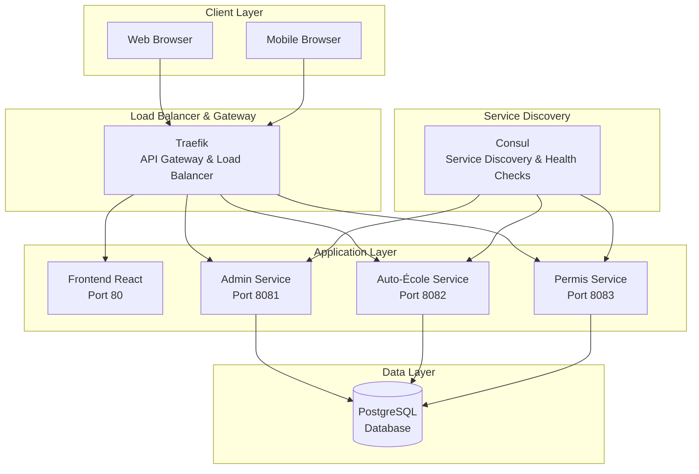

## Hiérarchie des Rôles et Permissions

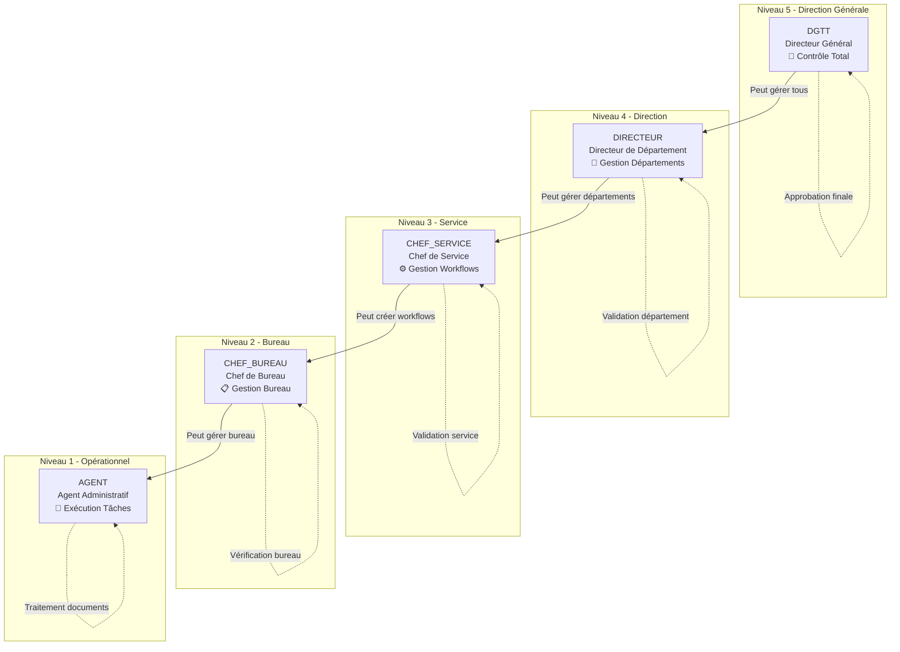

## Workflow Métier Complet

### Processus Auto-École → Candidat → Permis

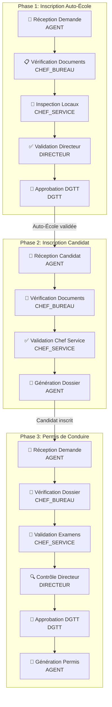

### Services Connexes (Connexes)

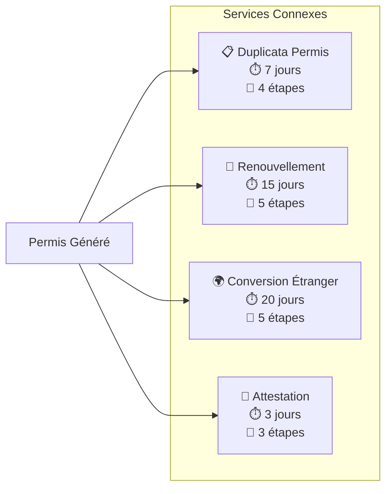

## Architecture des Services

### Admin Service (Workflow Engine)

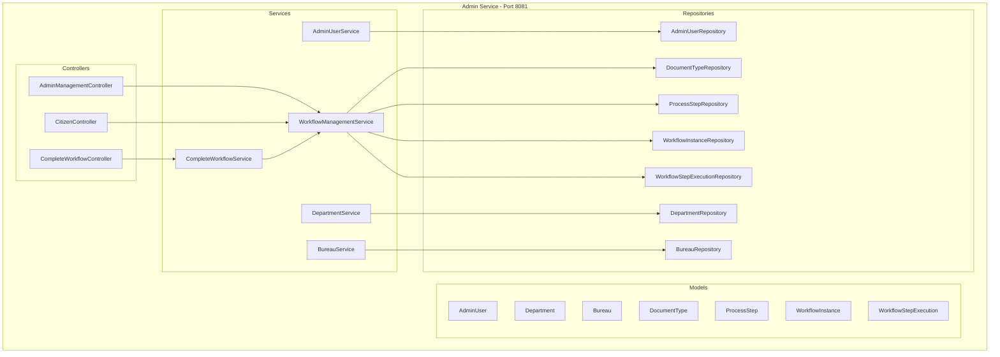

### Auto-École Service

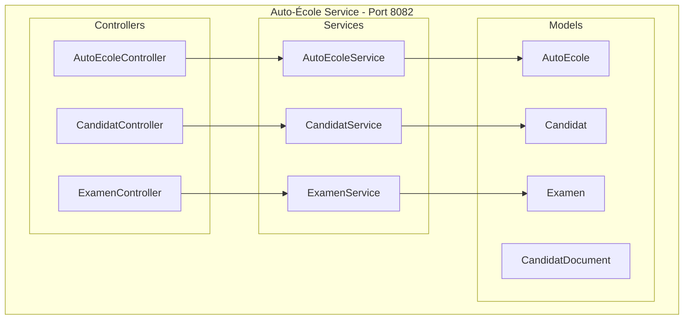

### Permis Service

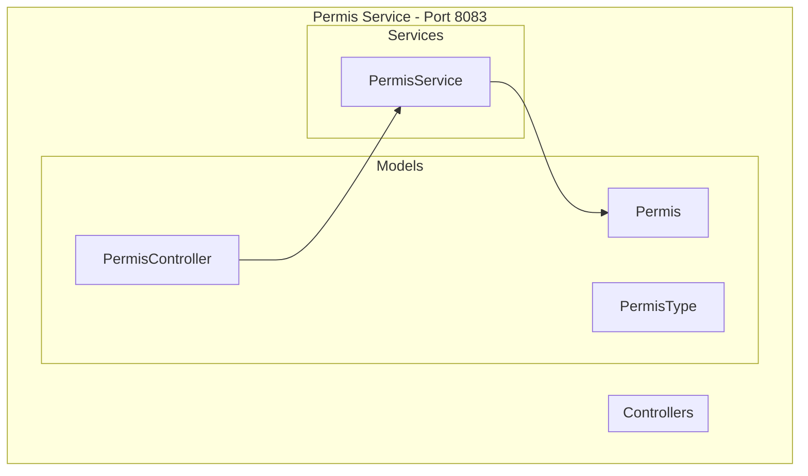

## Flux de Données

### Workflow Execution Flow

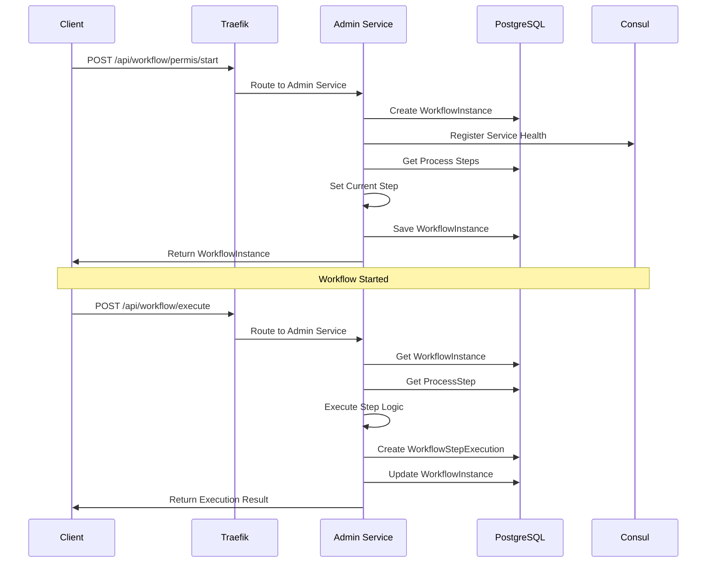

### Citizen Status Check Flow

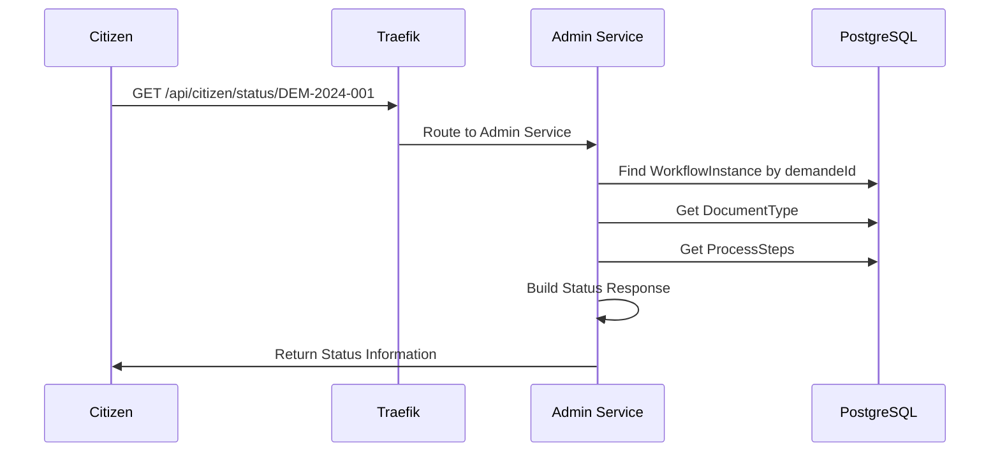

## Configuration et Déploiement

### Docker Compose Architecture

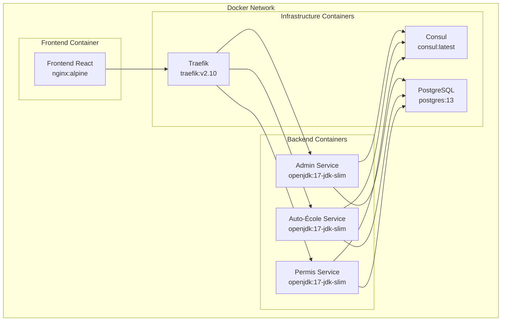

### Service Discovery

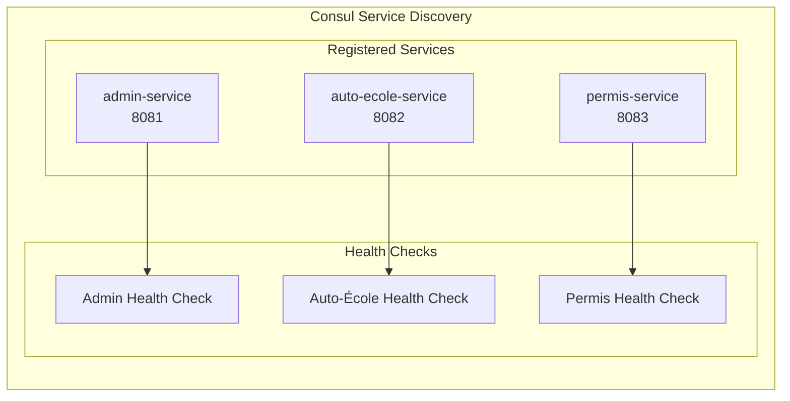

## Sécurité et Authentification

### Authentication Flow

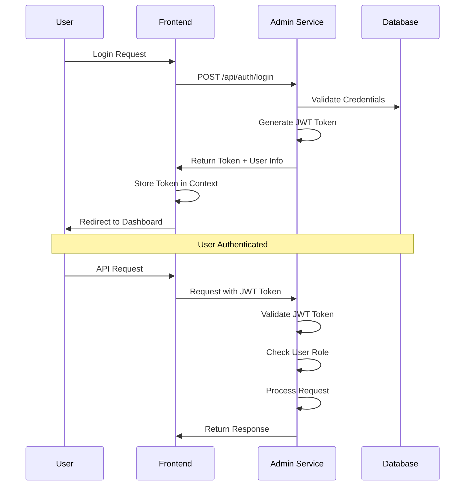

### Role-Based Access Control

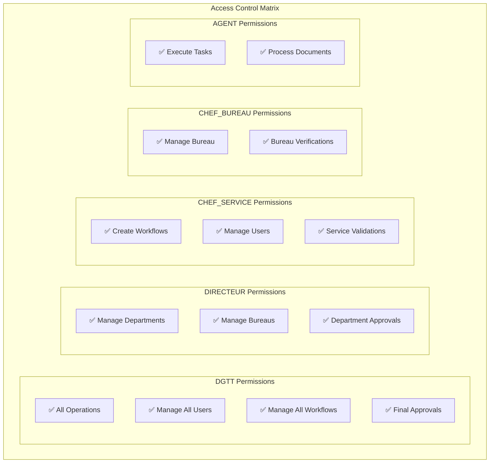

## Monitoring et Observabilité

### Health Check Architecture

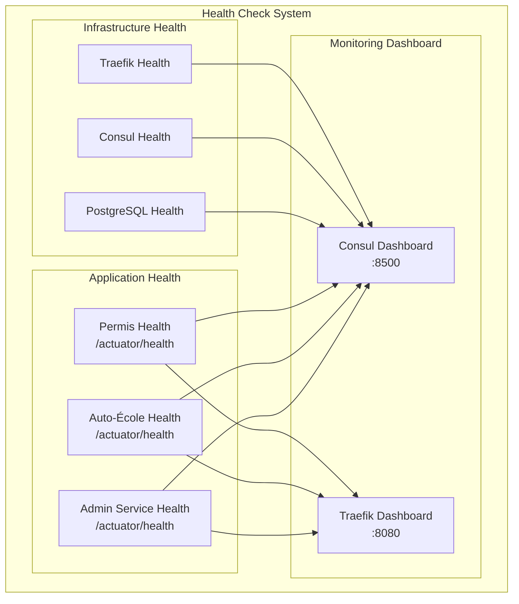

## Performance et Scalabilité

### Load Balancing Strategy

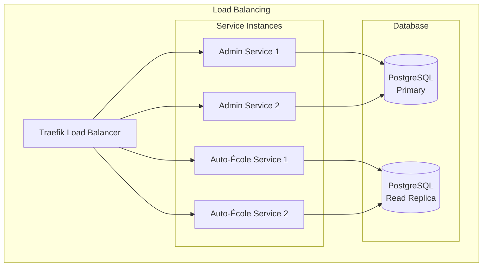

---

**Cette architecture garantit une scalabilité, une maintenabilité et une performance optimales pour le système R-DGTT Portail.**

