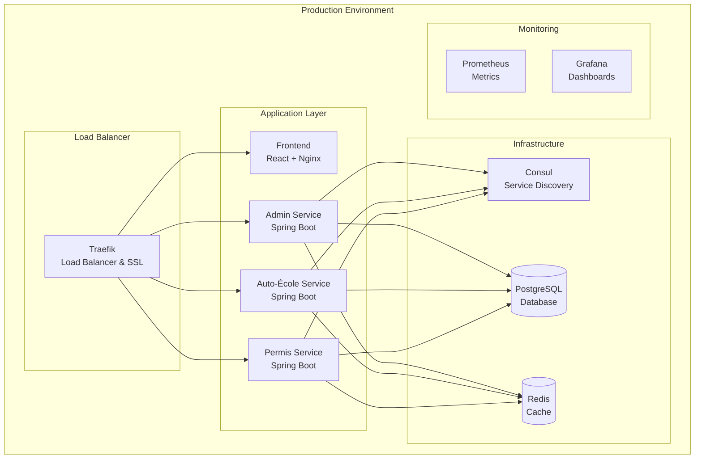

# 🚀 Guide de Déploiement R-DGTT

## Vue d'ensemble

Ce guide couvre le déploiement complet du système R-DGTT Portail, de l'environnement de développement à la production.

## 🏗️ Architecture de Déploiement



## 📋 Prérequis

### Serveur de Production

- **OS**: Ubuntu 20.04+ ou CentOS 8+
- **RAM**: 8GB minimum (16GB recommandé)
- **CPU**: 4 cores minimum (8 cores recommandé)
- **Storage**: 100GB SSD minimum
- **Network**: IP publique avec ports 80, 443, 8080 ouverts

### Logiciels Requis

```bash
# Docker & Docker Compose
curl -fsSL https://get.docker.com -o get-docker.sh
sudo sh get-docker.sh
sudo usermod -aG docker $USER

# Docker Compose
sudo curl -L "https://github.com/docker/compose/releases/download/v2.20.0/docker-compose-$(uname -s)-$(uname -m)" -o /usr/local/bin/docker-compose
sudo chmod +x /usr/local/bin/docker-compose

# Git
sudo apt update
sudo apt install git -y
```

## 🔧 Configuration

### 1. Cloner le Repository

```bash
git clone https://github.com/MoctarSidibe/rdgtt-portail.git
cd rdgtt-portail
```

### 2. Configuration des Variables d'Environnement

```bash
# Copier le fichier d'exemple
cp env.example .env

# Éditer les variables
nano .env
```

**Variables importantes**:

```bash
# Database
POSTGRES_DB=rdgtt_portail
POSTGRES_USER=rdgtt_user
POSTGRES_PASSWORD=rdgtt_password_2025

# Services
ADMIN_SERVICE_PORT=8081
AUTO_ECOLE_SERVICE_PORT=8082
PERMIS_SERVICE_PORT=8083
FRONTEND_PORT=80

# Consul
CONSUL_HOST=consul
CONSUL_PORT=8500

# Traefik
TRAEFIK_DASHBOARD_PORT=8080
TRAEFIK_DASHBOARD_USER=admin
TRAEFIK_DASHBOARD_PASSWORD=admin123

# SSL (Production)
SSL_EMAIL=admin@rdgtt.ga
DOMAIN=rdgtt.ga
```

### 3. Configuration SSL (Production)

```bash
# Créer le fichier de configuration SSL
mkdir -p traefik-config/ssl
nano traefik-config/ssl/tls.yml
```

```yaml
tls:
  certificates:
    - certFile: /ssl/cert.pem
      keyFile: /ssl/private.key
  stores:
    default:
      defaultCertificate:
        certFile: /ssl/cert.pem
        keyFile: /ssl/private.key
```

## 🚀 Déploiement

### Déploiement de Développement

```bash
# Build et démarrage
docker compose build --no-cache
docker compose up -d

# Vérifier les logs
docker compose logs -f

# Vérifier le statut
docker compose ps
```

### Déploiement de Production

```bash
# Utiliser le script de déploiement
chmod +x deploy-hetzner.sh
./deploy-hetzner.sh

# Ou déploiement manuel
docker compose -f docker-compose.yml up -d
```

### Script de Déploiement Automatique

```bash
#!/bin/bash
# deploy-production.sh

echo "🚀 Déploiement R-DGTT Portail en Production"

# 1. Mise à jour du code
echo "📥 Mise à jour du code..."
git pull origin main

# 2. Build des images
echo "🔨 Build des images Docker..."
docker compose build --no-cache

# 3. Arrêt des services existants
echo "⏹️ Arrêt des services existants..."
docker compose down

# 4. Démarrage des services
echo "▶️ Démarrage des services..."
docker compose up -d

# 5. Attendre que les services soient prêts
echo "⏳ Attente du démarrage des services..."
sleep 30

# 6. Vérification de la santé
echo "🏥 Vérification de la santé des services..."
curl -f http://localhost:8081/actuator/health || exit 1
curl -f http://localhost:8082/actuator/health || exit 1
curl -f http://localhost:8083/actuator/health || exit 1

# 7. Vérification de l'interface
echo "🌐 Vérification de l'interface..."
curl -f http://localhost/ || exit 1

echo "✅ Déploiement terminé avec succès!"
```

## 🔍 Vérification du Déploiement

### 1. Vérification des Services

```bash
# Vérifier que tous les services sont en cours d'exécution
docker compose ps

# Vérifier les logs
docker compose logs --tail=50

# Vérifier la santé des services
curl http://localhost:8081/actuator/health  # Admin Service
curl http://localhost:8082/actuator/health  # Auto-École Service
curl http://localhost:8083/actuator/health  # Permis Service
```

### 2. Vérification de l'Interface

```bash
# Vérifier l'interface web
curl http://localhost/

# Vérifier l'API
curl http://localhost/api/admin/users
```

### 3. Vérification de la Base de Données

```bash
# Se connecter à la base de données
docker exec -it $(docker ps -q --filter "name=postgres") psql -U rdgtt_user -d rdgtt_portail

# Vérifier les tables
\dt

# Vérifier les données
SELECT * FROM admin_users;
SELECT * FROM workflow_instances;
```

## 📊 Monitoring

### 1. Consul Dashboard

```bash
# Accéder au dashboard Consul
http://localhost:8500

# Vérifier les services enregistrés
curl http://localhost:8500/v1/catalog/services
```

### 2. Traefik Dashboard

```bash
# Accéder au dashboard Traefik
http://localhost:8080

# Vérifier les routes
curl http://localhost:8080/api/http/routers
```

### 3. Logs des Services

```bash
# Logs en temps réel
docker compose logs -f

# Logs d'un service spécifique
docker compose logs -f admin-service

# Logs avec filtrage
docker compose logs -f | grep ERROR
```

## 🔧 Maintenance

### Sauvegarde

```bash
# Sauvegarde de la base de données
docker exec $(docker ps -q --filter "name=postgres") pg_dump -U rdgtt_user rdgtt_portail > backup_$(date +%Y%m%d_%H%M%S).sql

# Sauvegarde des volumes
docker run --rm -v rdgtt_portail_postgres_data:/data -v $(pwd):/backup alpine tar czf /backup/postgres_data_$(date +%Y%m%d_%H%M%S).tar.gz -C /data .
```

### Mise à Jour

```bash
# Mise à jour du code
git pull origin main

# Rebuild et redémarrage
docker compose build --no-cache
docker compose up -d

# Vérification
docker compose ps
```

### Nettoyage

```bash
# Nettoyer les images inutilisées
docker image prune -f

# Nettoyer les volumes inutilisés
docker volume prune -f

# Nettoyer les réseaux inutilisés
docker network prune -f
```

## 🚨 Dépannage

### Problèmes Courants

#### 1. Service ne démarre pas

```bash
# Vérifier les logs
docker compose logs service-name

# Vérifier la configuration
docker compose config

# Redémarrer le service
docker compose restart service-name
```

#### 2. Base de données inaccessible

```bash
# Vérifier la connexion
docker exec -it $(docker ps -q --filter "name=postgres") psql -U rdgtt_user -d rdgtt_portail

# Vérifier les logs PostgreSQL
docker compose logs postgres
```

#### 3. Interface web inaccessible

```bash
# Vérifier Traefik
docker compose logs traefik

# Vérifier les routes
curl http://localhost:8080/api/http/routers
```

### Logs de Debug

```bash
# Activer les logs de debug
export LOG_LEVEL=DEBUG
docker compose up -d

# Logs détaillés
docker compose logs -f --details
```

## 🔒 Sécurité

### Configuration SSL

```bash
# Générer les certificats SSL
openssl req -x509 -nodes -days 365 -newkey rsa:2048 \
  -keyout traefik-config/ssl/private.key \
  -out traefik-config/ssl/cert.pem

# Configurer Traefik pour SSL
# Voir traefik-config/traefik.yml
```

### Firewall

```bash
# Ouvrir les ports nécessaires
sudo ufw allow 80
sudo ufw allow 443
sudo ufw allow 8080
sudo ufw enable
```

### Mots de Passe

```bash
# Changer les mots de passe par défaut
# Éditer .env
POSTGRES_PASSWORD=your_secure_password
TRAEFIK_DASHBOARD_PASSWORD=your_secure_password
```

## 📈 Performance

### Optimisation Docker

```bash
# Limiter les ressources
docker compose up -d --scale admin-service=2

# Monitoring des ressources
docker stats
```

### Optimisation Base de Données

```sql
-- Créer des index pour les performances
CREATE INDEX idx_workflow_instances_demande ON workflow_instances(demande_id);
CREATE INDEX idx_workflow_instances_statut ON workflow_instances(statut);
CREATE INDEX idx_admin_users_email ON admin_users(email);
```

## 🎯 Tests de Déploiement

### Tests Automatiques

```bash
# Script de tests
#!/bin/bash
echo "🧪 Tests de déploiement..."

# Test des services
curl -f http://localhost:8081/actuator/health || exit 1
curl -f http://localhost:8082/actuator/health || exit 1
curl -f http://localhost:8083/actuator/health || exit 1

# Test de l'interface
curl -f http://localhost/ || exit 1

# Test de l'API
curl -f http://localhost/api/admin/users || exit 1

echo "✅ Tous les tests sont passés!"
```

### Tests Manuels

1. **Interface Web**
   - Accéder à http://localhost/
   - Tester la connexion admin
   - Vérifier les fonctionnalités

2. **API**
   - Tester les endpoints
   - Vérifier l'authentification
   - Tester les workflows

3. **Base de Données**
   - Vérifier les données
   - Tester les requêtes
   - Vérifier les performances

---

**Ce guide assure un déploiement réussi et une maintenance efficace du système R-DGTT.**

