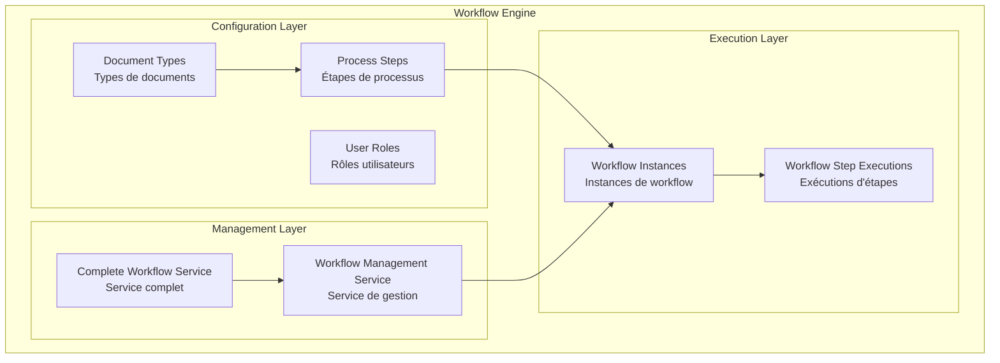
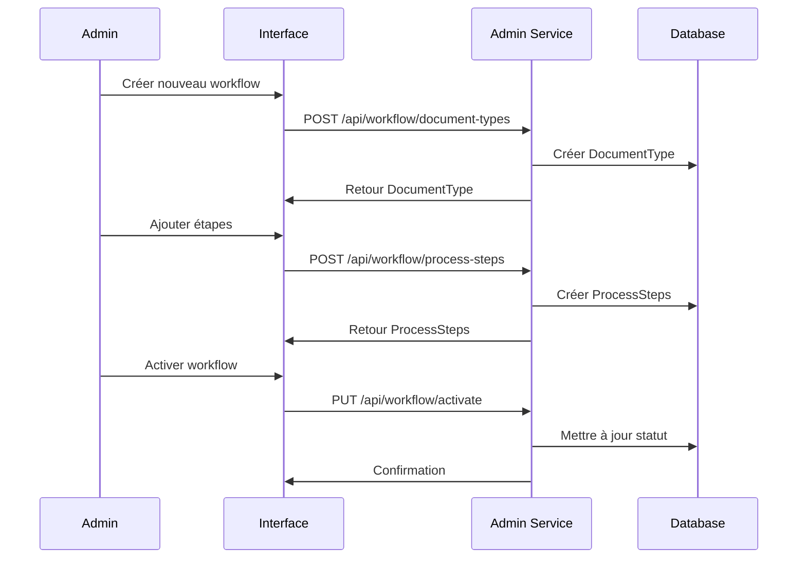
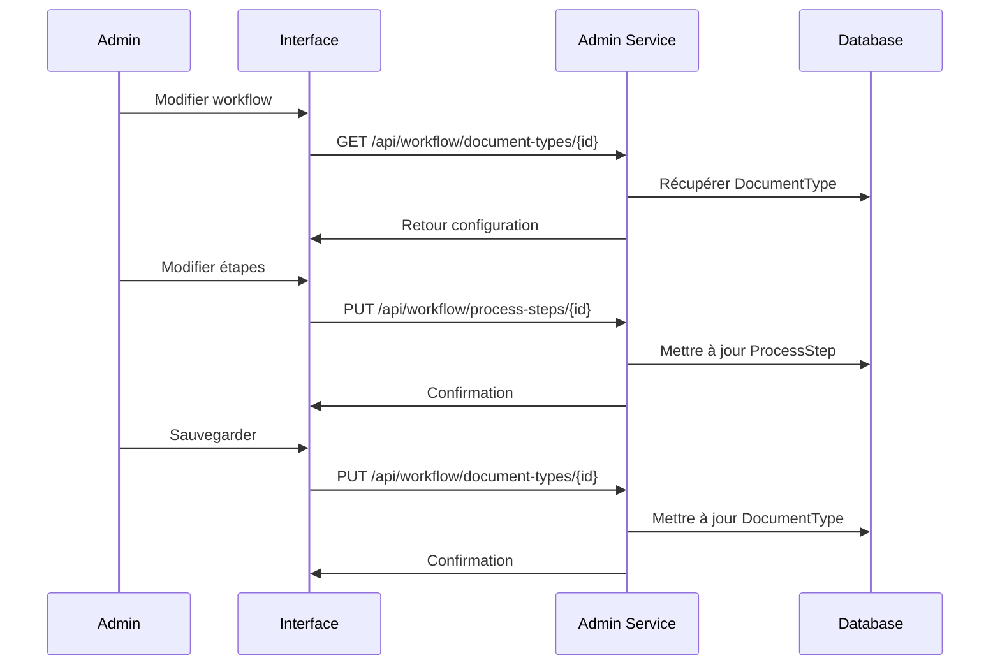
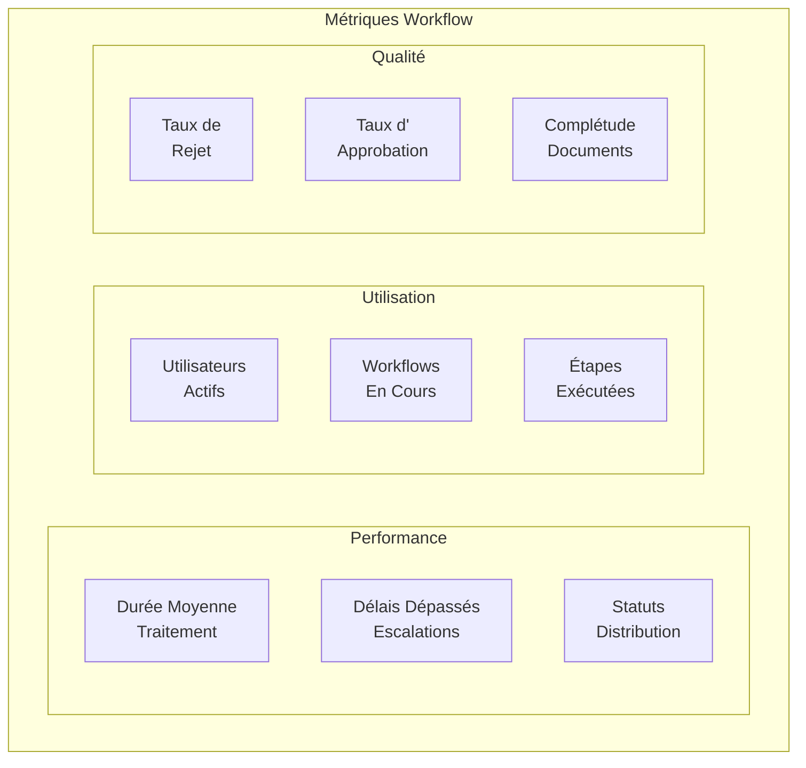
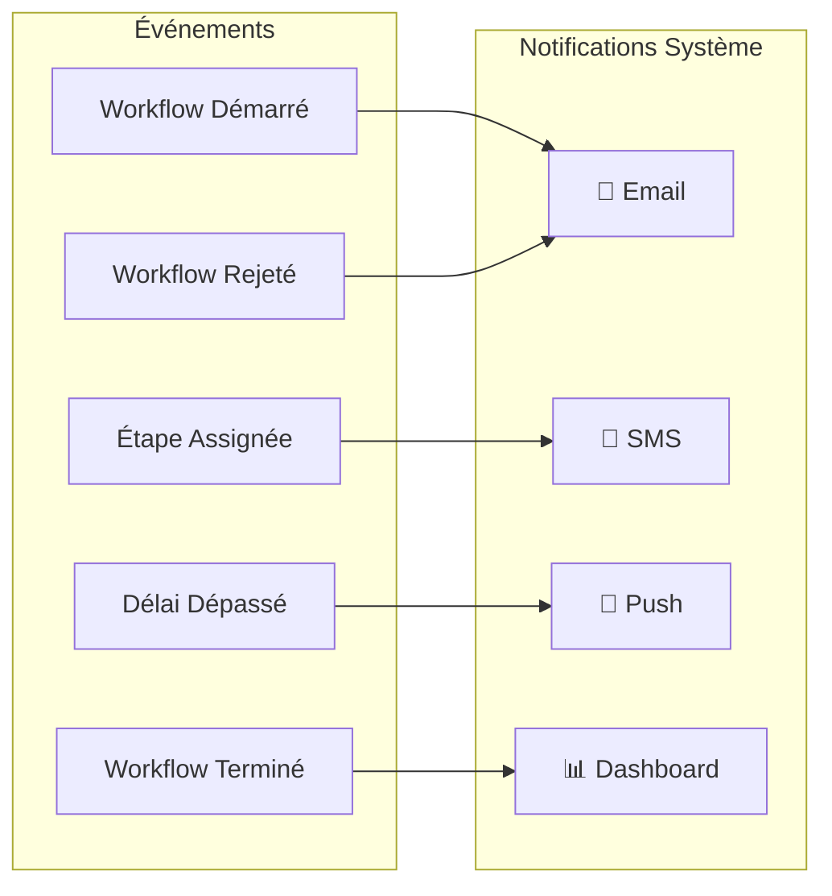

# 🔄 Guide des Workflows R-DGTT

## Vue d'ensemble des Workflows

Le système R-DGTT utilise un moteur de workflow configurable qui permet de gérer tous les processus métier de manière flexible et adaptative.

## 🏗️ Architecture des Workflows

### Composants Principaux



## 📋 Types de Workflows

### 1. Inscription Auto-École

**Objectif**: Enregistrer et valider une nouvelle auto-école

**Étapes**:
1. **Réception** (AGENT) - 1 jour
2. **Vérification Documents** (CHEF_BUREAU) - 3 jours
3. **Inspection Locaux** (CHEF_SERVICE) - 5 jours
4. **Validation Directeur** (DIRECTEUR) - 3 jours
5. **Approbation DGTT** (DGTT) - 3 jours

**Durée totale**: 15 jours

### 2. Inscription Candidat

**Objectif**: Enregistrer un candidat dans une auto-école

**Étapes**:
1. **Réception** (AGENT) - 1 jour
2. **Vérification Documents** (CHEF_BUREAU) - 2 jours
3. **Validation Chef Service** (CHEF_SERVICE) - 2 jours
4. **Génération Dossier** (AGENT) - 1 jour

**Durée totale**: 7 jours

### 3. Permis de Conduire (Processus Principal)

**Objectif**: Délivrer un permis de conduire

**Étapes**:
1. **Réception Demande** (AGENT) - 1 jour
2. **Vérification Dossier** (CHEF_BUREAU) - 3 jours
3. **Validation Examens** (CHEF_SERVICE) - 5 jours
4. **Contrôle Directeur** (DIRECTEUR) - 3 jours
5. **Approbation DGTT** (DGTT) - 5 jours
6. **Génération Permis** (AGENT) - 2 jours

**Durée totale**: 30 jours

## 🔄 Services Connexes (Connexes)

### 1. Duplicata Permis

**Objectif**: Délivrer un duplicata de permis perdu/volé

**Étapes**:
1. **Réception Demande** (AGENT) - 1 jour
2. **Vérification Original** (CHEF_BUREAU) - 2 jours
3. **Validation Chef Service** (CHEF_SERVICE) - 2 jours
4. **Génération Duplicata** (AGENT) - 2 jours

**Durée totale**: 7 jours

### 2. Renouvellement Permis

**Objectif**: Renouveler un permis expiré

**Étapes**:
1. **Réception Demande** (AGENT) - 1 jour
2. **Vérification Ancien Permis** (CHEF_BUREAU) - 3 jours
3. **Validation Médicale** (CHEF_SERVICE) - 5 jours
4. **Approbation Directeur** (DIRECTEUR) - 3 jours
5. **Génération Nouveau Permis** (AGENT) - 3 jours

**Durée totale**: 15 jours

### 3. Conversion Permis Étranger

**Objectif**: Convertir un permis étranger en permis gabonais

**Étapes**:
1. **Réception Demande** (AGENT) - 1 jour
2. **Vérification Permis Étranger** (CHEF_BUREAU) - 5 jours
3. **Validation Chef Service** (CHEF_SERVICE) - 5 jours
4. **Approbation Directeur** (DIRECTEUR) - 5 jours
5. **Génération Permis Gabonais** (AGENT) - 4 jours

**Durée totale**: 20 jours

### 4. Attestation d'Authenticité

**Objectif**: Vérifier l'authenticité d'un permis

**Étapes**:
1. **Réception Demande** (AGENT) - 1 jour
2. **Vérification Authenticité** (CHEF_BUREAU) - 1 jour
3. **Génération Attestation** (AGENT) - 1 jour

**Durée totale**: 3 jours

## 🎯 Configuration des Workflows

### Création d'un Nouveau Workflow



### Modification d'un Workflow Existant



## 🔧 API des Workflows

### Démarrer un Workflow

```bash
# Auto-École
POST /api/workflow/auto-ecole/start
{
  "autoEcoleName": "Auto-École Excellence",
  "demandeId": "AE-2024-001",
  "userId": "uuid"
}

# Candidat
POST /api/workflow/candidate/start
{
  "candidateName": "Jean Dupont",
  "autoEcoleId": "uuid",
  "demandeId": "CAND-2024-001",
  "userId": "uuid"
}

# Permis de Conduire
POST /api/workflow/permis/start
{
  "candidateId": "uuid",
  "demandeId": "PERMIS-2024-001",
  "userId": "uuid"
}

# Service Connexe
POST /api/workflow/connexe/start
{
  "connexeType": "DUPLICATA_PERMIS",
  "permisId": "uuid",
  "demandeId": "DUP-2024-001",
  "userId": "uuid"
}
```

### Exécuter une Étape

```bash
POST /api/workflow/execute
{
  "workflowId": "uuid",
  "stepId": "uuid",
  "decision": "APPROUVE|REJETTE|REDIRIGER",
  "commentaires": "Documents conformes",
  "userId": "uuid"
}
```

### Consulter le Statut

```bash
# Par numéro de demande
GET /api/workflow/instance/{demandeNumber}

# Par ID de workflow
GET /api/workflow/instances/{workflowId}

# Historique complet
GET /api/workflow/history/{workflowId}
```

## 📊 Monitoring des Workflows

### Métriques Disponibles



### Tableaux de Bord

1. **Dashboard Global**
   - Nombre total de workflows
   - Workflows en cours par statut
   - Performance par service
   - Délais moyens par type

2. **Dashboard par Rôle**
   - Tâches assignées
   - Délais à respecter
   - Historique des actions
   - Statistiques personnelles

3. **Dashboard Citoyen**
   - Statut des demandes
   - Progression des étapes
   - Délais estimés
   - Notifications

## 🔔 Notifications et Alertes

### Types de Notifications



### Configuration des Alertes

```bash
# Délai dépassé
GET /api/workflow/instances/overdue

# Workflows en attente
GET /api/workflow/instances/pending

# Statistiques temps réel
GET /api/workflow/statistics
```

## 🚀 Bonnes Pratiques

### Configuration des Workflows

1. **Définir clairement les rôles** pour chaque étape
2. **Estimer les délais** de manière réaliste
3. **Prévoir les escalations** en cas de dépassement
4. **Documenter les conditions** de validation
5. **Tester les workflows** avant mise en production

### Gestion des Délais

1. **Surveiller les métriques** de performance
2. **Ajuster les délais** selon les retours
3. **Implémenter des alertes** automatiques
4. **Former les utilisateurs** sur les processus
5. **Optimiser les étapes** les plus lentes

### Maintenance

1. **Auditer régulièrement** les workflows
2. **Mettre à jour** les configurations
3. **Archiver** les anciens workflows
4. **Sauvegarder** les configurations
5. **Documenter** les changements

---

**Ce guide permet une gestion efficace et flexible des workflows métier du système R-DGTT.**

